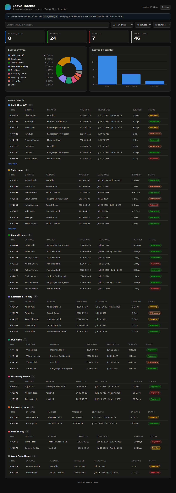

# Leave Tracker Dashboard

A React dashboard for company leave data, styled after the weekly leave
tracker layout. Data is read **live from a Google Sheet** — edit the sheet and
the dashboard updates on its own (it re-polls every 60 seconds and whenever you
switch back to the tab). Built with Vite + React, deploys to Vercel in one
click, no backend or database required.



## How it works

```
Google Sheet  ──(published CSV, read in the browser)──►  React dashboard on Vercel
```

The browser fetches the sheet through Google's public CSV endpoint, so there
are **no API keys or secrets** to manage. The only requirement is that the sheet
is shared as *"Anyone with the link → Viewer."*

Until a sheet is connected, the dashboard shows bundled **demo data** so you can
see the layout immediately.

---

## Setup — three steps

### 1. Prepare your Google Sheet

1. Put your leave data in a Google Sheet. Keep the header row exactly as your
   export has it:

   > `Employee Name`, `Mediamint ID`, `Email`, `Manager Name`, `Leave Type`,
   > `No. of Days/Hours`, `Applied On`, `Leave Dates`, `Reason`, `Day`,
   > `Start Date`, `End Date`, `Status`

   (Column order doesn't matter — columns are matched by header name. Extra
   columns are ignored.)

2. Click **Share** (top-right) → under *General access* choose
   **Anyone with the link** → role **Viewer** → **Done**.

3. Copy the sheet **id** from the URL — the long part between `/d/` and `/edit`:

   ```
   https://docs.google.com/spreadsheets/d/16abcXYZ...long-id...789/edit#gid=0
                                          └──────────  this  ──────────┘
   ```

> **To update the dashboard, just edit the sheet.** New rows, status changes,
> etc. appear automatically within a minute (or immediately on the **Refresh**
> button).

### 2. Push this repo to GitHub

It's already a git repo. Create a repo on GitHub and push (or use this one).

### 3. Deploy to Vercel

1. Go to [vercel.com](https://vercel.com) → **Add New… → Project** → import this
   GitHub repo. Vercel auto-detects Vite (build `npm run build`, output `dist`).
2. Before deploying, open **Environment Variables** and add:

   | Name | Value |
   | --- | --- |
   | `VITE_SHEET_ID` | the sheet id you copied in step 1 |
   | `VITE_SHEET_NAME` | the tab name, e.g. `Sheet1` |

3. Click **Deploy**. Done — your dashboard is live.

> Changed the env vars later? Trigger a redeploy in Vercel so the new values
> take effect (they're baked in at build time).

---

## Run locally

```bash
npm install
cp .env.example .env      # then fill in VITE_SHEET_ID / VITE_SHEET_NAME
npm run dev               # http://localhost:5173
```

Leave `.env` blank to preview with the bundled demo data.

```bash
npm run build             # production build into dist/
npm run preview           # serve the production build locally
```

---

## What's on the dashboard

- **Stat cards** — new (pending) requests, approved, rejected, and total leaves.
- **Leaves by type** — donut chart with a per-type breakdown; the long tail of
  rare types folds into "Other."
- **Leaves by country** — bar chart of leaves per country (see the note below on
  the optional `Country` column).
- **Leave records** — every leave, grouped by type, with a colored status pill.
- **Filters** — search by name / ID / manager, plus leave-type, status, and
  country dropdowns. All charts and cards respond to the filters.

> **Country column (optional).** If your sheet has a `Country` (or `Location`)
> column it is used directly. If it doesn't, every row defaults to **India** —
> change that default in `src/lib/types.ts` (`DEFAULT_COUNTRY`), or add a
> `Country` column to your sheet to break the bar chart out by office.

## Customizing

| Want to change… | Edit |
| --- | --- |
| Leave-type names & colors | `src/lib/transform.ts` (`LEAVE_TYPES`) |
| Status colors / labels | `src/lib/transform.ts` (`statusMeta`) |
| How often it re-polls | `src/lib/config.ts` (`REFRESH_INTERVAL_MS`) |
| Column → field mapping | `src/lib/types.ts` (`HEADER_MAP`) |
| Colors, spacing, dark theme | `src/styles.css` |

## Notes

- Leave types are mapped from their codes: `PTO` → Paid Time Off, `OT` →
  Overtime, `SL` → Sick Leave, `CL` → Casual Leave, `RH` → Restricted Holiday,
  `LOP` → Loss of Pay, `ML` → Maternity, `PL` → Paternity, `WFH` → Work From
  Home, `OD` → On Duty. Add or change these in `LEAVE_TYPES`.
- The demo data uses fictional names — no real employee data is stored in this
  repo. Real data only ever lives in your Google Sheet.
